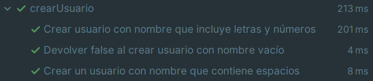
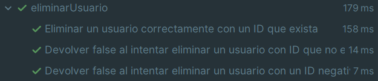
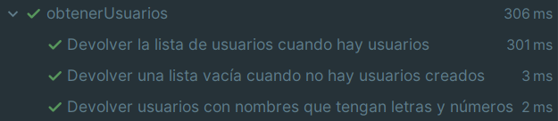
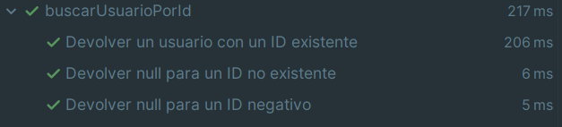
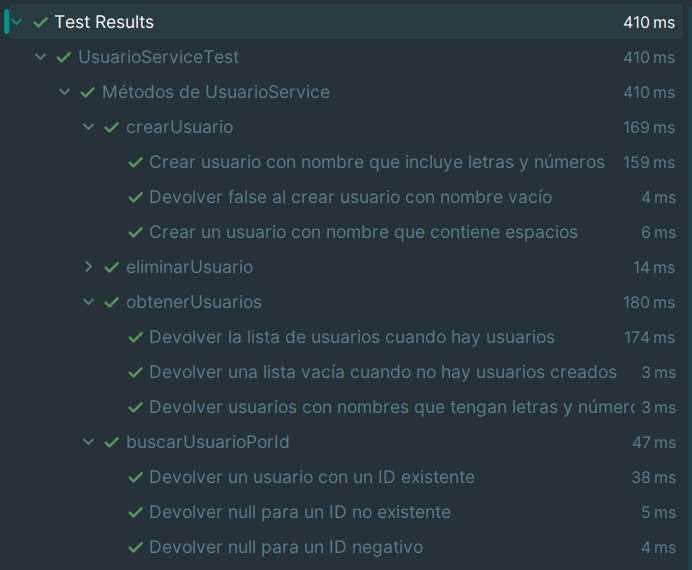
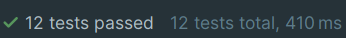

# Documentación Tests UsuarioService

## Elección de tests

- Para esta actividad se seleccionó hacer test sobre UsuarioService que contiene 4 métodos:
  - crearUsuario()
  - eliminarUsuario()
  - obtenerUsuarios()
  - buscarUsuarioPorId()

- Para cada método se realizará tests de tipo casos nominales y de error en este caso decidí hacer 3 test por método con un total de 12 tests.
- Los test se realizaran con kotest y mockk.

## Resultado de los test realizados

### Test método: crearUsuario() (3 tests)

[Permalink crearUsuario](https://github.com/RebelionAlberti/2425-varios-edes-prog-proyectotaskmanager-rebelion_alberti/blob/58ef55a4532a1aa766380a00783aeb83998b5a43/src/test/kotlin/UsuarioServiceTest.kt#L17-L43)

- Se realizan 3 tests para este método:
  - Un test para crear un usuario con letras y números.
  - Un test que debe devolver false cuando creas un usuario con un nombre vacío.
  - Un test para crear un usuario que contenga espacios.

### Test método: eliminarUsuario() (3 tests)

[Permalink eliminarUsuario](https://github.com/RebelionAlberti/2425-varios-edes-prog-proyectotaskmanager-rebelion_alberti/blob/58ef55a4532a1aa766380a00783aeb83998b5a43/src/test/kotlin/UsuarioServiceTest.kt#L45-L70)

- Se realizan 3 tests para este método:
    - Un test para eliminar un usuario de manera correcta.
    - Un test que debe devolver false al intentar eliminar un usuario con id que no existe.
    - Un test que debe devolver false al intentar eliminar un usuario con id negativo.

### Test método: obtenerUsuario() (3 tests)

[Permalink eliminarUsuario](https://github.com/RebelionAlberti/2425-varios-edes-prog-proyectotaskmanager-rebelion_alberti/blob/58ef55a4532a1aa766380a00783aeb83998b5a43/src/test/kotlin/UsuarioServiceTest.kt#L72-L99)

- Se realizan 3 tests para este método:
    - Un test para devolver la lista cuando hay usuarios.
    - Un test para devolver una lista vacía cuando no hay usuarios creados.
    - Un test que debe devolver usuarios que tengan letras y números.

### Test método: buscarUsuarioPorId() (3 tests)

[Permalink eliminarUsuario](https://github.com/RebelionAlberti/2425-varios-edes-prog-proyectotaskmanager-rebelion_alberti/blob/58ef55a4532a1aa766380a00783aeb83998b5a43/src/test/kotlin/UsuarioServiceTest.kt#L101-L127)

- Se realizan 3 tests para este método:
    - Un test para devolver un usuario con un id existente.
    - Un test para devolver null para un id no existente.
    - Un test que debe devolver null para un id negativo.

### Todos los tests

- Como podemos observar en la imagen todos los test pasan de forma satisfactoria.

## Tabla Resumen Tests

- La tabla que se muestra ahora muestra un resumen de todos los test realizados con información sobre lo que se llama, acción, resultado esperado etc.

| Método                   | Caso de prueba (entrada)                     | Acción/mock esperado                      | Resultado esperado                               |
|--------------------------|----------------------------------------------|-------------------------------------------|--------------------------------------------------|
| `crearUsuario(nombre)`   | Nombre con letras y números ("Adri11")       | Llamar a `repositorio.agregar(usuario)`   | Devuelve `true`, usuario creado correctamente    |
| `crearUsuario(nombre)`   | Nombre vacío ("")                            | Llamar a `repositorio.agregar(usuario)`   | Devuelve `false`, no se crea usuario             |
| `crearUsuario(nombre)`   | Nombre con espacios ("Adrian Fernandez")     | Llamar a `repositorio.agregar(usuario)`   | Devuelve `true`, usuario creado correctamente    |
| `eliminarUsuario(id)`    | ID válido (1)                                | Llamar a `repositorio.eliminar(1)`        | Devuelve `true`, usuario eliminado               |
| `eliminarUsuario(id)`    | ID no existente (1000)                       | Llamar a `repositorio.eliminar(1000)`     | Devuelve `false`, no se encontró usuario         |
| `eliminarUsuario(id)`    | ID negativo (-5)                             | Llamar a `repositorio.eliminar(-5)`       | Devuelve `false`, no se elimina usuario inválido |
| `obtenerUsuarios()`      | Lista con usuarios                           | Llamar a `repositorio.recuperarTodos()`   | Devuelve `lista` con usuarios                    |
| `obtenerUsuarios()`      | Lista vacía                                  | Llamar a `repositorio.recuperarTodos()`   | Devuelve `lista` vacía                           |
| `obtenerUsuarios()`      | Usuarios con letras y números en los nombres | Llamar a `repositorio.recuperarTodos()`   | Devuelve `lista` con usuarios con nombres mixtos |
| `buscarUsuarioPorId(id)` | ID válido                                    | Llamar a `repositorio.recuperarPorId(id)` | Devuelve `usuario` correspondiente               |
| `buscarUsuarioPorId(id)` | ID no existente                              | Llamar a `repositorio.recuperarPorId(id)` | Devuelve `null`                                  |
| `buscarUsuarioPorId(id)` | ID negativo                                  | Llamar a `repositorio.recuperarPorId(id)` | Devuelve `null`                                  |

- Aquí se puede comprobar que pasan los 12 test realizados y el tiempo en ms que tardan en ejecutar las pruebas.

