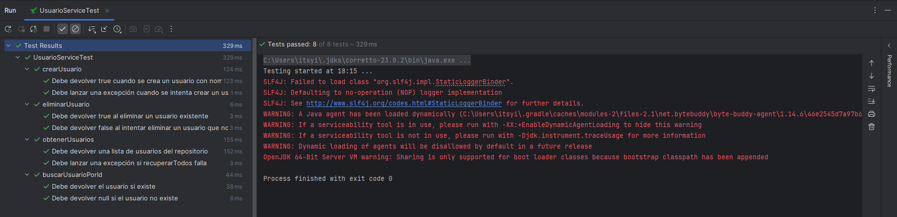

# 3.3 Test Unitarios y Moock
## 1.  **Selección del servicio**
Elige un único servicio de tu proyecto (p. ej. `TaskService`, `UserService`,…), que dependa de un repositorio inyectado vía constructor.

### El servicio seleccionado ha sido `UsuarioService`

---

## 2.  **Identificación de métodos**
Lista todos los métodos públicos de ese servicio. Por cada método, anota:

    -   Nombre del método
    -   Parámetros de entrada
    -   Resultado esperado o efecto en el repositorio

### Métodos
- `crearUsuario()`
    - **Parámetro**: nombre: *String*
    - **Resultado esperado**: Creación del usuario y su agregación al repositorio
- `eliminarUsuario()`
    -  **Parámetro**: id: *Int*
    - **Resultado esperado**: Eliminación del usuario con el ID proporcionado del repositorio
- `obtenerUsuarios()`
    - **Parámetro**:
    - **Resultado esperado**: Lista de todos los usuarios del repositorio
- `buscarUsuarioPorId()`
    - **Parámetro**: id: *Int*
    - **Resultado esperado**: El usuario con el ID proporcionado sacado del repositorio

---

## 3. **Diseño de casos de prueba**
Para cada método, diseña al menos **dos casos**:

-   **Caso nominal** (datos válidos, comportamiento esperado).
-   **Caso de error o borde**  (datos inválidos, repositorio vacío, excepción, etc).

### Tabla de casos
| Método de servicio | Valor pasado al método | Resultado esperado, de los métodos del mock a los que se llama     | Acción | Resultado esperado |
|--|--|--------------------------------------------------------------------|--|--|
|crearUsuario()  | nombre: *"Jesus"* | `mockkRepositorio.agregar()` devuelve `true`                       | Llamar a crearUsuario("Jesus") | Retorno `true` y creación del usuario |
|crearUsuario()  | nombre: *""* | `mockkRepositorio.agregar()` devuelve `false` o `IllegalArgumentException` | Llamar a crearUsuario("") | Excepción |
|eliminarUsuario()  | id: *1* (Usuario existente) | `mockkRepositorio.eliminar()` devuelve `true`                              | Llamar a eliminarUsuario(1) | Retorno `true` y eliminación del usuario |
|eliminarUsuario()  | id: *33* (Usuario que no existe) | `mockkRepositorio.eliminar()` devuelve `false`                             | Llamar a eliminarUsuario(33) | Retorno `false` y no eliminar el usuario (ya que no existe) |
|obtenerUsuarios()  |  | `mockkRepositorio.recuperarTodos()` devuelve una lista de usuarios         | Llamar a obtenerUsuarios() | Lista de usuarios del repositorio|
|obtenerUsuarios() | id: `14` | `mockkRepositorio.recuperarTodos()` devuelve una excepción                 | Llamar a obtenerUsuarios(14) | Excepción |
|buscarUsuarioPorId()  | id: *1* (Usuario existente) | `mockkRepositorio.recuperarPorId()` devuelve el usuario correspondiente    | buscarUsuarioPorId(1) | La información del usuario cuya ID es 1|
|buscarUsuarioPorId()  | id: *33* (Usuario que no existe) | `mockkRepositorio.recuperarPorId()` devuelve `null`                        | Llamar a buscarUsuarioPorId(33) | Resultado nulo|

---

## 4. **Pruebas de funcionamiento**

---

## 5. **Enlaces al código**
- `crearUsuario()`
  - https://github.com/RebelionAlberti/2425-varios-edes-prog-proyectotaskmanager-rebelion_alberti/blob/e3eba8a30e25baed554377686959e2a21056fd92/src/test/kotlin/aplicacion/UsuarioServiceTest.kt#L17-L35
- `eliminarUsuario()`
  - https://github.com/RebelionAlberti/2425-varios-edes-prog-proyectotaskmanager-rebelion_alberti/blob/e3eba8a30e25baed554377686959e2a21056fd92/src/test/kotlin/aplicacion/UsuarioServiceTest.kt#L37-L54
- `obtenerUsuarios()`
  - https://github.com/RebelionAlberti/2425-varios-edes-prog-proyectotaskmanager-rebelion_alberti/blob/e3eba8a30e25baed554377686959e2a21056fd92/src/test/kotlin/aplicacion/UsuarioServiceTest.kt#L56-L78
- `buscarUsuarioPorId()`
  - https://github.com/RebelionAlberti/2425-varios-edes-prog-proyectotaskmanager-rebelion_alberti/blob/e3eba8a30e25baed554377686959e2a21056fd92/src/test/kotlin/aplicacion/UsuarioServiceTest.kt#L80-L101
