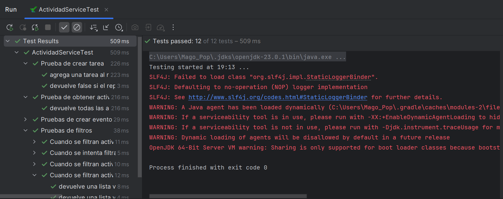

# 3.3 Test Unitarios y Mock para `ActividadService`

## 1. Selección del servicio
El servicio seleccionado es **ActividadService**, que depende de un repositorio `IActividadRepository` inyectado vía constructor.

## 2. Identificación de métodos

- **crearTarea**
    - Parámetros: `descripcion: String`, `etiquetas: List<String>`
    - Resultado esperado: Crea una nueva tarea y la agrega al repositorio. Retorna `true` si se agrega correctamente, `false` en caso contrario.

- **obtenerActividades**
    - Parámetros: ninguno
    - Resultado esperado: Devuelve una lista con todas las actividades almacenadas.

- **crearEvento**
    - Parámetros: `fechaRealizacion: String`, `ubicacion: String`, `descripcion: String`, `etiquetas: List<String>`
    - Resultado esperado: Crea un evento y lo agrega al repositorio. Retorna `true` si se agrega correctamente.
º
- **filtrarPorTipo**
    - Parámetros: `tipo: String`
    - Resultado esperado: Devuelve una lista filtrada según el tipo de actividad (`Tarea` o `Evento`). Si el tipo no es válido, devuelve lista vacía.

- **filtrarPorEstado**
    - Parámetros: `estado: Status`
    - Resultado esperado: Devuelve una lista filtrada de actividades que coinciden con el estado indicado (ej. `ABIERTA`, `CERRADA`). Devuelve lista vacía si no hay coincidencias.

### Tabla de información de los test:

| Método de servicio           | Caso de prueba                                     | Resultado del mock                            | Acción llamada                           | Resultado esperado                                                      |
|-----------------------------|----------------------------------------------------|------------------------------------------------|-------------------------------------------|-------------------------------------------------------------------------|
| crearTarea(...)             | Datos válidos                                      | `mockRepo.agregarActividad` devuelve `true`   | Llamar a `crearTarea(...)`                | Retorna `true`, la tarea se agrega correctamente                       |
| crearTarea(...)             | Datos válidos pero el repositorio falla            | `mockRepo.agregarActividad` devuelve `false`  | Llamar a `crearTarea(...)`                | Retorna `false`, no se agrega                                          |
| obtenerActividades()       | Actividades existen en el repositorio              | `mockRepo.recuperarTodas` devuelve lista      | Llamar a `obtenerActividades()`           | Devuelve la lista esperada                                             |
| crearEvento(...)           | Datos válidos                                      | `mockRepo.agregarActividad` devuelve `true`   | Llamar a `agregarActividad(evento)`       | Evento agregado correctamente, retorna `true`                          |
| crearEvento(...)           | Fecha inválida                                     | `mockRepo.agregarActividad` devuelve `true`   | Llamar a `agregarActividad(evento)`       | Evento agregado (no se valida la fecha en el test)                    |
| filtrarPorTipo(...)        | Tipo válido (ej. "Tarea")                          | `mockRepo.recuperarTodas` devuelve lista      | Llamar a `filtrarPorTipo("Tarea")`        | Devuelve solo elementos tipo Tarea                                     |
| filtrarPorTipo(...)        | Tipo inválido                                      | `mockRepo.recuperarTodas` devuelve lista      | Llamar a `filtrarPorTipo("Invalido")`     | Devuelve lista vacía                                                   |
| filtrarPorEstado(...)      | Estado válido con coincidencias (ej. ABIERTA)      | `mockRepo.recuperarTodas` devuelve lista      | Llamar a `filtrarPorEstado(Status.ABIERTA)` | Devuelve solo tareas con estado ABIERTA                              |
| filtrarPorEstado(...)      | Estado válido sin coincidencias                    | `mockRepo.recuperarTodas` devuelve lista      | Llamar a `filtrarPorEstado(Status.CERRADA)` | Devuelve lista vacía                                                  |

## 3. Prueba de funcionamiento

## 4. Enlaces al código

- Crear tarea:

    https://github.com/RebelionAlberti/2425-varios-edes-prog-proyectotaskmanager-rebelion_alberti/blob/45a3734ca3e6824b344020fdfa6b53ea372d5970/src/test/kotlin/aplicacion/ActividadServiceTest.kt#L18-L41

- Obtener actividades:

    https://github.com/RebelionAlberti/2425-varios-edes-prog-proyectotaskmanager-rebelion_alberti/blob/45a3734ca3e6824b344020fdfa6b53ea372d5970/src/test/kotlin/aplicacion/ActividadServiceTest.kt#L43-L56

- Crear evento:

    https://github.com/RebelionAlberti/2425-varios-edes-prog-proyectotaskmanager-rebelion_alberti/blob/45a3734ca3e6824b344020fdfa6b53ea372d5970/src/test/kotlin/aplicacion/ActividadServiceTest.kt#L58-L90

- Filtrar por tipo:

    https://github.com/RebelionAlberti/2425-varios-edes-prog-proyectotaskmanager-rebelion_alberti/blob/45a3734ca3e6824b344020fdfa6b53ea372d5970/src/test/kotlin/aplicacion/ActividadServiceTest.kt#L92-L131

- Filtrar por estado:

    https://github.com/RebelionAlberti/2425-varios-edes-prog-proyectotaskmanager-rebelion_alberti/blob/45a3734ca3e6824b344020fdfa6b53ea372d5970/src/test/kotlin/aplicacion/ActividadServiceTest.kt#L133-L185

