# Descripción de la Actividad

- Para esta actividad instalaremos Ktlint o Detekt que son analizadores estáticos para analizar nuestro código y encontrar errores.
- Documentaremos todo el proceso de instalación y ejecutaremos un primer análisis sobre el código
- Identificaremos al menos 5 errores de código según la herramienta que instalemos y los documentaremos mostrando su solución
- Probaremos a cambiar alguna regla de la configuración de la herramienta y mostraremos como afecta al código.
- Por último responderemos algunas preguntas.

# Elección de herramienta: Ktlint

- La elección de Ktlint es debido a que considero que es una herramienta más fácil que usar que herramientas como detekt y aunque tiene menos opciones de configuración tienen funciones muy interesantes como el formateo automático sin necesidad de hacer cambios manuales.

# Instalación de Ktlint

- Para instalar Ktlint tendremos que acceder a nuestro build.gradle para agregar el plugin que será el siguiente:
  - Comenzaremos agregando en el bloque de plugins la siguiente línea `id("org.jlleitschuh.gradle.ktlint") version "11.6.0"`
  - A continuación sincronizamos el gradle

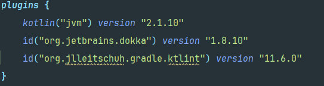

# Uso de Ktlint

- Una vez instalado Ktlint introduciremos en la terminal `./gradlew ktlintCheck`
- Este comando realizará el análisis estático de código y mostrará los errores de estilo y formato.

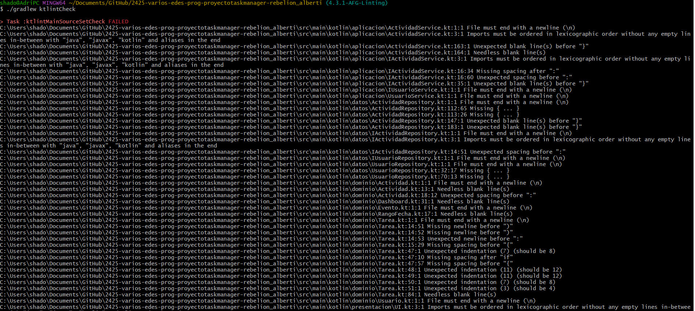

- Ahora en el directorio *build/reports/ktlint/ktlintMainSourceSetCheck/ktlintMainSourceSetCheck.txt* [este](build/reports/ktlint/ktlintMainSourceSetCheck) encontramos el txt donde podemos encontrar el reporte de Ktlint con todos los errores de estilo y formato.

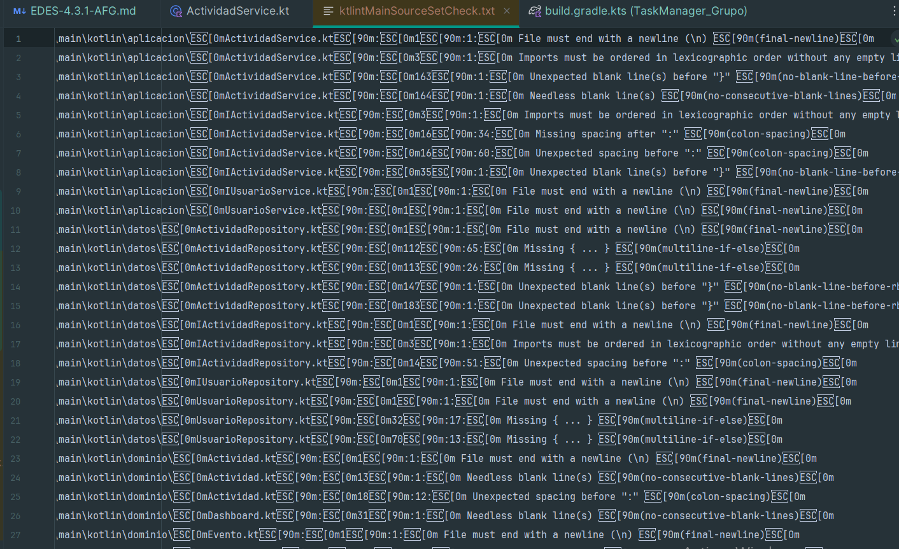

- Ahora podemos usar el comando en la terminal `./gradlew ktlintFormat` para ejecutar la correción automática que en mi opinion es bastante buena y considero que la configuración que tiene Ktlint por defecto es bastante buena.
- Como podemos ver tras la ejecución exitosa si vamos al txt mencionado antes estará vacío o tendrá los errores que deberán ser solucionados manualmente (en mi caso vacío).

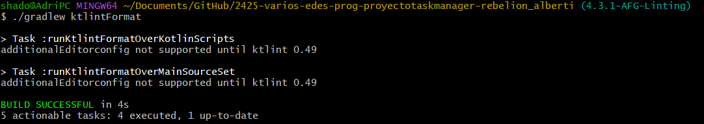

# Configuración de Ktlint

- Aunque Ktlint es menos configurable que detekt existen opciones para configurar las reglas que sigue como por ejemplo crear en la raíz del proyecto un archivo llamado [.editorconfig](.editorconfig)
- Podremos agregar alguna regla para probar que funciona (no la voy a mantener porque me gusta la configuración por defecto).
- En el archivo .editorconfig escribiremos la siguiente regla como se puede ver en la imagen:

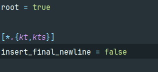

- Usamos `root = true` para asegurarnos de que el archivo .editorconfig este en la raíz.
- Escribimos `[*.{kt,kts}]` que serán los archivos que se verán afectados por esta regla.
- Agregamos la regla que queremos probar `max_line_length = 120` esto provocara que todas las líneas del código deban tener un maximo de 120 caracteres.
- Realizaremos un `./gradlew ktlintCheck` en la terminal para ver si hay alguna línea del código que incumple esta nueva regla.

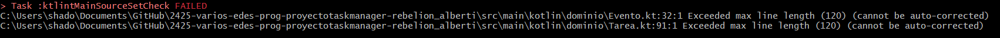

- Como hemos podido ver en la imagen hay 2 errores y el mismo Ktlint nos dice que no pueden ser autocorregidos asi que lo solucionaré yo manualmente.
- Ahora mediante imágenes mostraré él antes y él después ten en cuenta que entre imágenes.

## Antes

- Returns muy largos sobrepasando los 120 caracteres tanto que no se ve ni en pantalla.

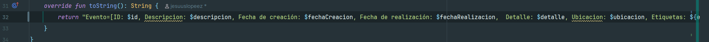

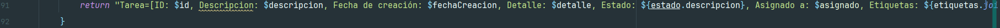

# Después

- Se concatenan el contenido de los returns para acortarlos y que se vea por pantalla.

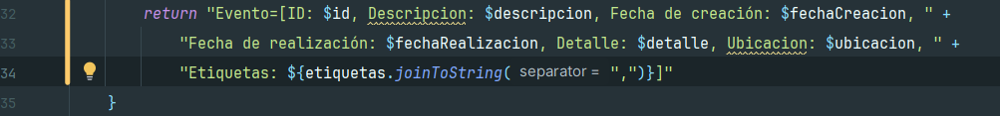

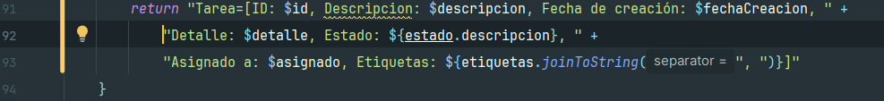

- Volvemos a pasar `./gradlew ktlintCheck` para ver si se han solucionado y como podemos ver ya no detecta nada.

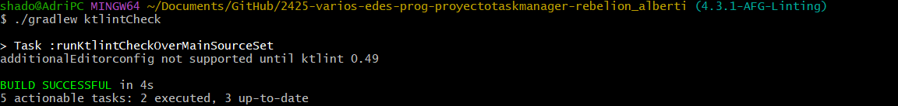

# Errores encontrados y sus soluciones

## 1- No tener salto de linea al final del código

- En este caso en el archivo Tarea.kt no tenía en un principio salto de línea al final del código y es muy recomendable debido a que puede aumentar la compatibilidad con otras herramientas, mejora la legibilidad del código por consola entre otras cosas.
- El autocorrector de kt link lo soluciono como se puede ver en los permalinks.

### Antes

https://github.com/RebelionAlberti/2425-varios-edes-prog-proyectotaskmanager-rebelion_alberti/blob/7437b72bef4d7274964000857e8ace6d461ff5f3/src/main/kotlin/dominio/Tarea.kt#L86-L90

### Después

- Github después del commit con los cambios no registra el salto de línea final asi que te lo dejo por aquí como quedaría

```kotlin
override fun toString(): String {
        val asignado = asignadoA?.nombre ?: "No asignado"
        return "Tarea=[ID: $id, Descripcion: $descripcion, Fecha de creación: $fechaCreacion, " +
            "Detalle: $detalle, Estado: ${estado.descripcion}, " +
            "Asignado a: $asignado, Etiquetas: ${etiquetas.joinToString(", ")}]"
    }
}
// salto de linea final
```

## 2- No tener salto de línea a los parámetros cuando son muchos

- En este caso en ActividadService en el método crearEvento podemos ver que tenía muchos parámetros y es recomendable cuando hay muchos hacer saltos de líneas entre ellos para mejorar su legibilidad.
- El autocorrector de kt link lo soluciono como se puede ver en los permalinks.

### Antes

https://github.com/RebelionAlberti/2425-varios-edes-prog-proyectotaskmanager-rebelion_alberti/blob/7437b72bef4d7274964000857e8ace6d461ff5f3/src/main/kotlin/aplicacion/ActividadService.kt#L19-L22

### Después

https://github.com/RebelionAlberti/2425-varios-edes-prog-proyectotaskmanager-rebelion_alberti/blob/c9ab5ed6b20087c0a67e5d233d5e69bd9e70f69a/src/main/kotlin/aplicacion/ActividadService.kt#L19-L24

## 3- No tener ordenado los imports por paquetes y alfabéticamente

- En este caso en ActividadService podemos ver que tenía los imports puestos de cualquier manera y Ktlint te los ordenas por paquetes y alfabéticamente para que sean más legibles y poder identificarlos.
- El autocorrector de kt link lo soluciono como se puede ver en los permalinks.

### Antes

https://github.com/RebelionAlberti/2425-varios-edes-prog-proyectotaskmanager-rebelion_alberti/blob/7437b72bef4d7274964000857e8ace6d461ff5f3/src/main/kotlin/aplicacion/ActividadService.kt#L3-L11

### Después

https://github.com/RebelionAlberti/2425-varios-edes-prog-proyectotaskmanager-rebelion_alberti/blob/c9ab5ed6b20087c0a67e5d233d5e69bd9e70f69a/src/main/kotlin/aplicacion/ActividadService.kt#L3-L11

## 4- No usar llaves en expresiones if-else en una sola linea

- En este caso en ActividadRepository en una parte del método cargarActividadesCsv() se pueden ver expresiones if-else en una sola línea y Ktlint te lo formatea para que estén en líneas diferentes y usando multiples llaves para que sea más legible y se vea a simple vista menos complejo.
- El autocorrector de kt link lo soluciono como se puede ver en los permalinks.

### Antes

https://github.com/RebelionAlberti/2425-varios-edes-prog-proyectotaskmanager-rebelion_alberti/blob/7437b72bef4d7274964000857e8ace6d461ff5f3/src/main/kotlin/datos/ActividadRepository.kt#L112-L115

### Después

https://github.com/RebelionAlberti/2425-varios-edes-prog-proyectotaskmanager-rebelion_alberti/blob/c9ab5ed6b20087c0a67e5d233d5e69bd9e70f69a/src/main/kotlin/datos/ActividadRepository.kt#L114-L125

## 5- En un If seguido de un return no usar llaves

- En este caso en UsuarioRepository en el método cargarUsuario() tenemos un if seguido de un return sin usar líneas Ktlint te lo formatea y coloca llaves, ya que asi es más fácil identificar fallos en casos de error y se mantiene una estructura en el código.
- El autocorrector de kt link lo soluciono como se puede ver en los permalinks.

### Antes

https://github.com/RebelionAlberti/2425-varios-edes-prog-proyectotaskmanager-rebelion_alberti/blob/7437b72bef4d7274964000857e8ace6d461ff5f3/src/main/kotlin/datos/UsuarioRepository.kt#L31-L32

### Después

https://github.com/RebelionAlberti/2425-varios-edes-prog-proyectotaskmanager-rebelion_alberti/blob/c9ab5ed6b20087c0a67e5d233d5e69bd9e70f69a/src/main/kotlin/datos/UsuarioRepository.kt#L31-L33

# Preguntas

[1]

## **1.a ¿Qué herramienta has usado, y para qué sirve?**

- Para esta actividad he usado **Ktlint**.
- Sirve para analizar codigo y en este caso esta herramienta en concreto formateo automatico del codigo para el lenguaje de programacion Kotlin.
- Con ella podemos detectar errores como:
  - Errores de estilo y formato.
  - Unificar el estilo de codigo que se quiere usar sobre todo en equipos de desarrollo.
  - Seguir unas reglas estrictas sobre el codigo para que sea mas facil el mantenimiento y a la hora de leer codigo.

## **1.b ¿Cuáles son sus características principales?**

- Fácil instalación mediante gradle o maven incluso desde el marketplace de IDEA se puede descargar el plugin.
- Combina análisis estático con formateo de código en una sola herramienta.
- Fácil uso apenas un par de comandos por terminal y puedes usar la herramienta.
- Formateo Automático la propia herramienta hace los cambios en el código si son posibles de hacer en caso de que no se pueda hacer se indicará por terminal para hacer el cambio de forma manual.
- Su personalización no es mucha, pero mediante un archivo de tipo .editorconfig se puede modificar algunos parámetros y reglas.
- Sigue el estilo oficial de JetBrains para la programación en Kotlin y de esta forma tener un código de más calidad.

## **1.c ¿Qué beneficios obtengo al utilizar dicha herramienta?**

- Se logra una mejor consistencia en el código.
- Ayuda a detectar malas prácticas sobre el código
- Código más fácil de leer.
- Formateo de código automático.
- Código de mayor calidad.
- Al ser el código más legible y fácil de comprender facilita tareas como el mantenimiento.

[2]

## **2.a De los errores/problemas que la herramienta ha detectado y te ha ayudado a solucionar, ¿cuál es el que te ha parecido que ha mejorado más tu código?**

- A mi juicio no son errores como tal son problemas de estilo, pero si tuviera que destacar uno de ellos me quedaría con 4- No usar llaves en expresiones `if-else en una sola línea`
- Simplemente agregando un poco de separación y algunas llaves hace que el código sea mucho más claro y fácil de entender.

### Antes

https://github.com/RebelionAlberti/2425-varios-edes-prog-proyectotaskmanager-rebelion_alberti/blob/7437b72bef4d7274964000857e8ace6d461ff5f3/src/main/kotlin/datos/ActividadRepository.kt#L112-L115

### Después

https://github.com/RebelionAlberti/2425-varios-edes-prog-proyectotaskmanager-rebelion_alberti/blob/c9ab5ed6b20087c0a67e5d233d5e69bd9e70f69a/src/main/kotlin/datos/ActividadRepository.kt#L114-L125

## **2.b ¿La solución que se le ha dado al error/problema la has entendido y te ha parecido correcta?**

- Es una buena solución como he mencionado en la anterior pregunta creo que se hace mucho más claro y fácil de comprender.
- Unos pequeños cambios sobre el fragmento de código como agregar algunas llaves y darle algo de espacio ayuda bastante.

## **2.c ¿Por qué se ha producido ese error/problema?**

- No recuerdo que haya sido yo la persona que escribió el código de ese método, pero muchas veces a la hora de escribir código por velocidad y por querer acabar lo antes posible se toman las peores decisiones que pueden crear malas prácticas.
- Igualmente, no creo que sea un error grave, ya que el código seguía funcionando lo que no podemos saber si a la larga podría haber producido algún tipo de error.

[3]

## **3.a ¿Qué posibilidades de configuración tiene la herramienta?**

- La verdad que la herramienta tiene poca configuración principalmente a traves de un archivo .editorconfig que tendremos que crear en la raíz del proyecto este nos permitirá activar/desactivar reglas y modificar algunas a nuestro gusto en caso de que no nos gusten las reglas por defecto.
- Se pueden realizar también algunas modificaciones a traves del build gradle como por ejemplo activar algunas reglas experimentales o excluir directorios entre otras opciones.
- Como punto a favor la configuración que trae por defecto es lo suficientemente buena y hace que la herramienta sea fácil de usar.

## **3.b De esas posibilidades de configuración, ¿cuál has configurado para que sea distinta a la que viene por defecto?**

- Modifique el tamaño máximo de las líneas de código a 120 para evitar que se tuviera que scrollear lateralmente y asi que el código fuera mucho más fácil de leer.
- Esta modificación fue realizada a traves del archivo de configuración .editorconfig.

## **3.c Pon un ejemplo de como ha impactado en tu código, enlazando al código anterior al cambio, y al posterior al cambio,**

- En las imágenes se puede ver claramente que el código no se podía llegar a leer por ser demasiado largo y la solución que se le dio a traves de la modificación del tamaño de las líneas de código fue buena porque se llega a leer perfectamente sin necesidad de scrollear lateralmente.


[4]

## **4 ¿Qué conclusiones sacas después del uso de estas herramientas?**

- Mi conclusión es que es una herramienta muy util si queremos mantener nuestro código de una manera y de esta forma seguir un estándar que puede ayudar a la hora de que otra persona pueda llegar a leer tu código o se necesite hacer un mantenimiento sobre él y gracias al uso de Ktlint sea todo mucho más fácil de comprender.
- Además, quiero añadir que es muy fácil tanto de instalar como de usar solo se necesita agregar en el build.gradle y con dos comandos en la terminal basta para que esté funcionando.