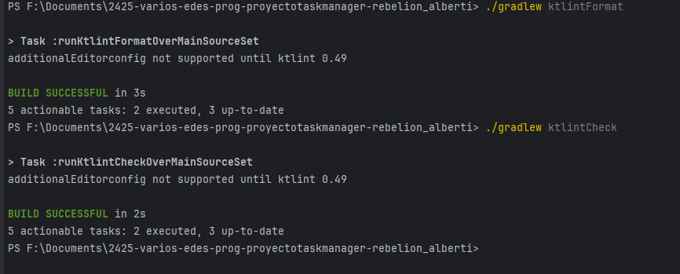
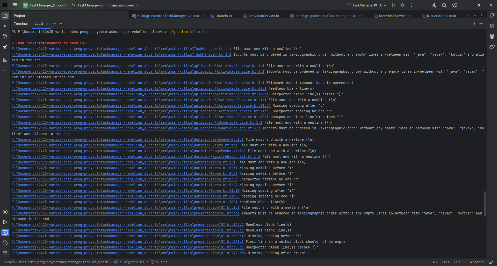
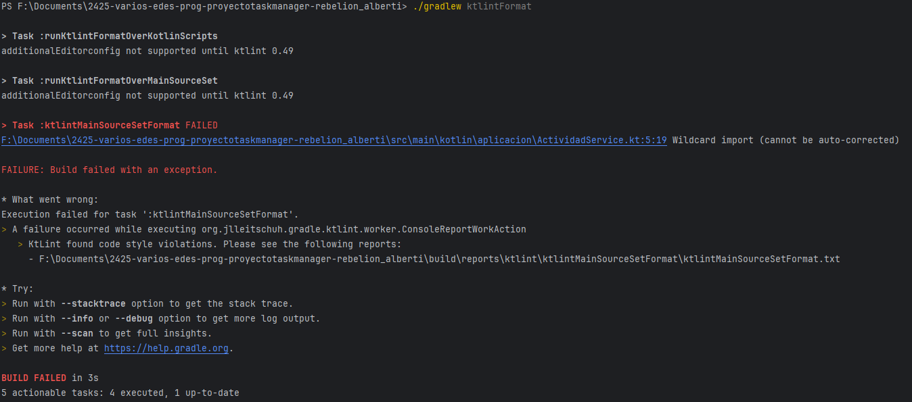

# Analizadores de código estático: Linting
## Descripción de la Actividad
La actividad consiste en instalar y usar un analizador de código estático (Detekt o Ktlint) en el proyecto que vienes desarrollando, capturar evidencias gráficas, detectar y clasificar errores, aplicar soluciones y explorar las posibilidades de configuración de la herramienta elegida.

Instala y usa los analizadores de código comentados en clase: **Detekt, Ktlint**
## Preguntas
### 1.
- 1.a ¿Que herramienta has usado, y para que sirve?
    - He usado `KtLint`, sirve para analizar el código de manera estática, es decir, sin llegar a ejecutarlo, lo que hace el código más limpio y más fácil a la hora de leerlo. Para instalarlo hay que añadirlo a los plugins en el archivo `build.gradle.kts`
    - https://github.com/RebelionAlberti/2425-varios-edes-prog-proyectotaskmanager-rebelion_alberti/blob/e9e47a79f0fd5131b80e760063f15cfd87359cc0/build.gradle.kts#L1-L4

- 1.b ¿Cuales son sus características principales?
    - Sus características principales son la capacidad de analizar el código sin ejecutarlo, la detección/corrección de errores automáticamente, el seguir la sintaxis oficial de Kotlin y su facilidad de integración.

- 1.c ¿Qué beneficios obtengo al utilizar dicha herramienta?
    - El poder mejorar mi código y dejarlo de manera más limpia y legible para en un futuro, poder entenderlo sin problema ya sea que lo utilice yo u otra persona, además de rapidez a la hora de arreglarlo, ya que con un simple comando lo formatea todo instantáneamente.

### 2.
- 2.a De los errores/problemas que la herramienta ha detectado y te ha ayudado a solucionar, ¿Cuál es el que te ha parecido que ha mejorado más tu código?
    - Pienso que quizás uno de los que más me ha podido ayudar ha sido `Wildcard importing`, que era el importar todo lo que contenía un paquete, ya que realmente no utilizaba todo y podía hacer el programa algo menos eficiente, otro error que se ha repetido bastante en mi código han sido los espacios o las líneas en blanco, que en algunos casos sobraban y en otros faltaban.

- 2.b ¿La solución que se le ha dado al error/problema la has entendido y te ha parecido correcta?
    - Si, simplemente ha sido cambiar el `import dominio.*` por cada una de las que fuese necesaria.

- 2.c ¿Por qué se ha producido ese error/problema?
    - Simplemente por un error mío a la hora de importar paquetes, que se me ocurrió hacer `import dominio.*` por acortar código, pero viéndolo ahora reconozco que no parece algo muy óptimo por simplemente reducir 5 líneas.

### 3.
- 3.a ¿Que posibilidades de configuración tiene la herramienta?
    - Permite configurar reglas de estilo mediante un archivo `.editorconfig`.  
      Se pueden activar/desactivar reglas, ajustar el límite de caracteres por línea y el uso de sangrías o espacios.
- 3.b De esas posibilidades de configuración, ¿cuál has configurado para que sea distinta a la que viene por defecto?
    - He aumentado la máxima longitud por líneas de 120 a 150 con `max_line_length = 150`.
    - https://github.com/RebelionAlberti/2425-varios-edes-prog-proyectotaskmanager-rebelion_alberti/blob/44c1e25a085620ffb98cbed74408b17fe536a2a2/.editorconfig#L1-L6
- 4.c Pon un ejemplo de como ha impactado en tu código, enlazando al código anterior al cambio, y al posterior al cambio
    - En el `override fun toString()` de `Tarea` y `Evento` he tenido que dividir el `return` en varias líneas para conseguir la validez por parte de `KtLint`
    - Antes:
        - https://github.com/RebelionAlberti/2425-varios-edes-prog-proyectotaskmanager-rebelion_alberti/blob/e9e47a79f0fd5131b80e760063f15cfd87359cc0/src/main/kotlin/dominio/Tarea.kt#L79-L83
        - https://github.com/RebelionAlberti/2425-varios-edes-prog-proyectotaskmanager-rebelion_alberti/blob/e9e47a79f0fd5131b80e760063f15cfd87359cc0/src/main/kotlin/dominio/Evento.kt#L19-L22

    - Después:
        - https://github.com/RebelionAlberti/2425-varios-edes-prog-proyectotaskmanager-rebelion_alberti/blob/44c1e25a085620ffb98cbed74408b17fe536a2a2/src/main/kotlin/dominio/Tarea.kt#L83-L91
        - https://github.com/RebelionAlberti/2425-varios-edes-prog-proyectotaskmanager-rebelion_alberti/blob/44c1e25a085620ffb98cbed74408b17fe536a2a2/src/main/kotlin/dominio/Evento.kt#L31-L38

### 4.
- 4 ¿Qué conclusiones sacas después del uso de estas herramientas?
    - Son herramientas muy útiles para arreglar los formatos del código, hacerlo cumplir con las sintaxis establecida por `Kotlin`. En general me ha ayudado a tener un código más limpio y ordenado de una manera muy sencilla.

## Capturas de pantalla

## Lista de errores
1. F:\Documents\2425-varios-edes-prog-proyectotaskmanager-rebelion_alberti\src\main\kotlin\dominio\Usuario.kt:1:1 File must end with a newline (\n)
   - Descripción: El archivo debe terminar con una nueva línea.
   - Solución: Añadir una nueva línea al final.
2. F:\Documents\2425-varios-edes-prog-proyectotaskmanager-rebelion_alberti\src\main\kotlin\datos\repository\IRepository.kt:22:28 Unexpected spacing before ":"
    - Descripción: Espacio inesperado antes de ":".
    - Solución: Eliminar el espacio anterior a los ":".
3. F:\Documents\2425-varios-edes-prog-proyectotaskmanager-rebelion_alberti\src\main\kotlin\datos\dao\UsuarioDAO.kt:6:17 Missing spacing before ":"
    - Descripción: Falta un espacio antes de ":".
    - Solución: Añadir un espacio antes de los ":".
4. F:\Documents\2425-varios-edes-prog-proyectotaskmanager-rebelion_alberti\src\main\kotlin\datos\dao\UsuarioDAO.kt:81:9 Unexpected newline before "else"
    - Descripción: Nueva linea inesperada antes de "else".
    - Solución: Eliminar la nueva línea anterior al else.
5. F:\Documents\2425-varios-edes-prog-proyectotaskmanager-rebelion_alberti\src\main\kotlin\aplicacion\ActividadService.kt:3:1 Wildcard import (cannot be auto-corrected)
    - Descripción: Importación comodín
    - Solución: Eliminar `import dominio.*` e importar cada cosa individualmente.

## Configuraciones
https://github.com/RebelionAlberti/2425-varios-edes-prog-proyectotaskmanager-rebelion_alberti/blob/9a514be238dab9d8b5740695df8524cb1838e9a4/.editorconfig#L1-L6

## Commits relevantes
- Antes: https://github.com/RebelionAlberti/2425-varios-edes-prog-proyectotaskmanager-rebelion_alberti/tree/ca8859a57648fb731cea2822557009721332027c

- Después: https://github.com/RebelionAlberti/2425-varios-edes-prog-proyectotaskmanager-rebelion_alberti/tree/TaskManager-Linting-jesuuslopeez
