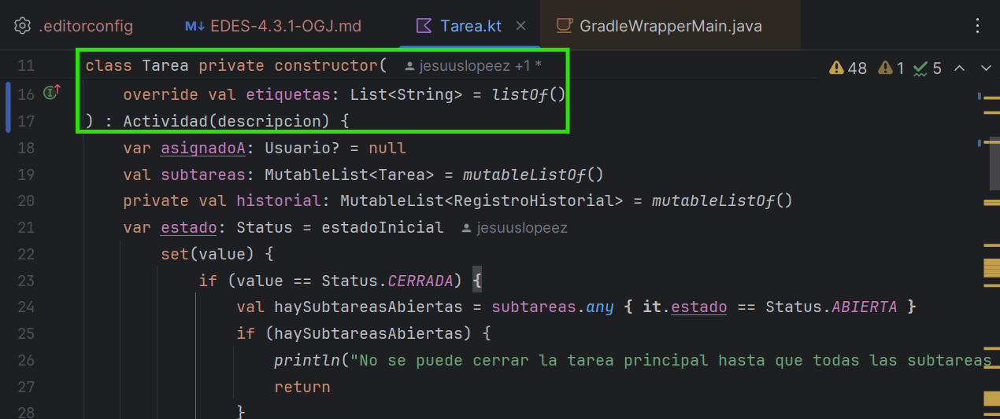
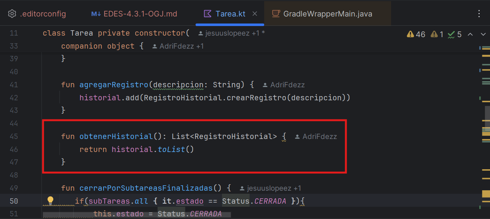

# Practica Ktling 

## Errores y soluciones 

------------------------------------------------------------------------------------

### Nº1 Expected a single space before class body (standard:class-signature)

- **Error**

- **Solución**

------------------------------------------------------------------------------------

### Nº2 Unexpected newline before ":" (standard:colon-spacing)

- **Error**

- **Solución**

------------------------------------------------------------------------------------

### Nº3 Expected a blank line for this declaration (standard:blank-line-before-declaration)

- **Error**

- **Solución**

------------------------------------------------------------------------------------

### Nº4 Function body should be replaced with body expression (standard:function-expression-body)

- **Error**

- **Solución**

------------------------------------------------------------------------------------

### Nº5 Unexpected indentation (7) (should be 8) (standard:indent)

- **Error**

- **Solución**

------------------------------------------------------------------------------------

## Preguntas

### 1.a ¿Qué herramienta has usado, y para qué sirve?

He usado la herramienta Ktlint, esta herramienta que ayuda a mantener tu código limpio, ordenado y consistente.

### 1.b ¿Cuáles son sus características principales?

Sus principales características son su sencillez, su automaticidad, su ligereza y la posibilidad de añadir reglas personalizadas.

### 1.c ¿Qué beneficios obtengo al utilizar dicha herramienta?

Con esta herramienta puedes mantener tu código organizado, limpio, legible y con calidad de forma automática, gracias a su automaticidad.

### 2.a De los errores/problemas que la herramienta ha detectado y te ha ayudado a solucionar, ¿cuál es el que te ha parecido que ha mejorado más tu código?

De los errores que he cubierto con la herramienta los que pienso que hán mejorado más el código son los de faltas de introducciones,
ya que mejora mucho su legibilidad y entendimiento.

### 2.b ¿La solución que se le ha dado al error/problema la has entendido y te ha parecido correcta?

Sí, la he entendido y claro que me ha parecido correcta, ya que gracias a eso el código obtiene un nivel de entendimiento y legibilidad mayor.

### 2.c ¿Por qué se ha producido ese error/problema?

Debido a que a la hora de desarrollar el código no se separó bien el código y generaba una posible confusión en su lectura.

### 3.a ¿Qué posibilidades de configuración tiene la herramienta?

- Ignorar archivos o carpetas

- Cambiar el máximo de caracteres por línea

- Desactivar reglas específicas desde el archivo ".editorconfig"

- Elegir entre solo revisar o formatear código automáticamente

### 3.b De esas posibilidades de configuración, ¿cuál has configurado para que sea distinta a la que viene por defecto?

- Indentación con espacios y no con tabulaciones.
- Líneas de código de máximo 120 caracteres.
- Al final de cada archivo debe haber un salto de línea.
- Define el sístema de codificación que es el estándar con caracteres especiales.
- Los saltos de línea debe usar el carácter LF, típico de sistemas Unix, Linux y macOS.

### 3.c Pon un ejemplo de como ha impactado en tu código, enlazando al código anterior al cambio, y al posterior al cambio

- Enlace del commit anterior al cambio ( https://github.com/RebelionAlberti/2425-varios-edes-prog-proyectotaskmanager-rebelion_alberti )

- Enlace del commit posterior al cambio ( https://github.com/RebelionAlberti/2425-varios-edes-prog-proyectotaskmanager-rebelion_alberti/tree/Linting_%C3%93scar_Garc%C3%ADa_Ja%C3%A9n )

### 4 ¿Qué conclusiones sacas después del uso de estas herramientas?

En conclusión esta herramienta es muy útil, ya que te permite mejorar la calidad del código haciéndolo más legible y entendible por el resto de personas.
