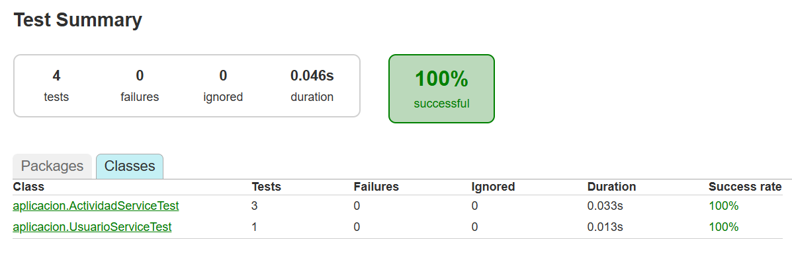

# Identificar Code Smells y Patrones de refactorización aplicados

- Vamos a identificar algunos code smells y como podemos

## 1 - Bloater: Primitive Obsession

- Es un code smell que ocurre cuando se usan tipos primitivos como Strings o Int se usan para representar conceptos importantes en lugar de crear tipo o clases dedicadas.
- Esto puedo provocar varios problemas como:
    - Equivocaciones con valores inválidos o errores a la hora de escribir.
    - Hace que el código sea difícil de mantener y sea menos expresivo.
    - Dispersa la lógica relacionada con el tipo por todo el código

### Antes

- En el parámetro recibe un String el cual está mal visto porque es un tipo primitivo para representar un tipo importante como es el tipo de Actividad.

https://github.com/RebelionAlberti/2425-varios-edes-prog-proyectotaskmanager-rebelion_alberti/blob/e4494c88ca23f905dabd7bed396934d7434b979a/src/main/kotlin/aplicacion/ActividadService.kt#L106-L114

### Después

- Para solucionar este error usaremos el patron de refactorización **Replace Data Value with Object** que consiste en remplazar un parámetro primitivo (en nuestro caso una String) por un objeto en este caso creamos un enum class con las opciones de las actividades posibles el cual usaremos como parámetro en el método.
- Esta es la refactorización realizada sobre el método.

https://github.com/RebelionAlberti/2425-varios-edes-prog-proyectotaskmanager-rebelion_alberti/blob/b5e80c4746f70d728e53e96ad5aaaea86a9ddaa6/src/main/kotlin/aplicacion/ActividadService.kt#L107-L114

- Para ello hemos tenido que crear una enum class con los tipos de actividades y también un par de modificaciones en la UI y en la Interfaz IActividadService, ya que recibían una String y hemos tenido que realizar la modificación para que reciban el enum class.

https://github.com/RebelionAlberti/2425-varios-edes-prog-proyectotaskmanager-rebelion_alberti/blob/b5e80c4746f70d728e53e96ad5aaaea86a9ddaa6/src/main/kotlin/aplicacion/TipoActividad.kt#L3-L5

https://github.com/RebelionAlberti/2425-varios-edes-prog-proyectotaskmanager-rebelion_alberti/blob/b5e80c4746f70d728e53e96ad5aaaea86a9ddaa6/src/main/kotlin/aplicacion/IActividadService.kt#L25

https://github.com/RebelionAlberti/2425-varios-edes-prog-proyectotaskmanager-rebelion_alberti/blob/b5e80c4746f70d728e53e96ad5aaaea86a9ddaa6/src/main/kotlin/presentacion/UI.kt#L316-L325

# Prueba Unitaria

https://github.com/RebelionAlberti/2425-varios-edes-prog-proyectotaskmanager-rebelion_alberti/blob/877b05b0000d3e2347b8c8a28a858a5bbf022303/src/test/kotlin/ActividadServiceTest.kt#L54-L70

## 2 - Object-Orientation Abusers: Switch Statements

- Este code smell ocurre cuando el código usa condicionales como switch, when, if-else entre otras condicionales se usan para controlar el comportamiento en función de tipos o estados
- Puede provocar lo siguiente:
    - Rompe la orientación de los objetos porque la lógica no está distribuida en las clases que deberían manejarla.
    - Hace difícil extender o modificar el código sin cambiar todos los condicionales.
    - Puede generar código repetitivo y difícil de entender.

### Antes

- Se usa un when que evalúa el estado de cada actividad desde fuera de la clase Tarea rompiendo el principio de encapsulamiento en lugar de delegar esa lógica a la propia clase que maneja los estados de Tarea.

https://github.com/RebelionAlberti/2425-varios-edes-prog-proyectotaskmanager-rebelion_alberti/blob/e4494c88ca23f905dabd7bed396934d7434b979a/src/main/kotlin/aplicacion/ActividadService.kt#L116-L124

### Después

- Para solucionar este Code Smell con el patrón de refactorización **Replace Conditional with Polymorphism** que consiste en sustituir estructuras condicionales por métodos polimórficos definidos en alguna subclase.
- Esta es la refactorización realizada sobre el código:

https://github.com/RebelionAlberti/2425-varios-edes-prog-proyectotaskmanager-rebelion_alberti/blob/7d7f2bc3d9905392901ffaa70172f4960fffa569/src/main/kotlin/aplicacion/ActividadService.kt#L116-L120

- Para que funcione hemos tenido que crear el método estaEnEstado en la clase Tarea para que de esta forma cada objeto Tarea puede decir si está en el estado dado y de esta forma evitas repetir it.estado == Status.X varias veces.

https://github.com/RebelionAlberti/2425-varios-edes-prog-proyectotaskmanager-rebelion_alberti/blob/7d7f2bc3d9905392901ffaa70172f4960fffa569/src/main/kotlin/dominio/Tarea.kt#L89-L91

# Prueba Unitaria

https://github.com/RebelionAlberti/2425-varios-edes-prog-proyectotaskmanager-rebelion_alberti/blob/877b05b0000d3e2347b8c8a28a858a5bbf022303/src/test/kotlin/ActividadServiceTest.kt#L17-L32

## 3 - Dispensables: Duplicated Code

- Es cuando un fragmento de código aparece copiado en varios lugares. Esto es problemático porque:
    - Aumenta la dificultad para mantener el código.
    - Sí hay que cambiar algo hay que actualizarla en multiples sitios lo que puede generar errores.
    - Reduce la claridad y concisión del código.

### Antes

- Encontramos código duplicado en los 2 métodos de abajo los cuales recuperan la tarea y validan su tipo antes de ejecutar la lógica esto provoca que el código sea largo y menos mantenible.
- La parte que se duplica es:

```kotlin
val tarea = repositorio.recuperarPorId(id)
if (tarea is Tarea) {
    // Resto del codigo
}
```

https://github.com/RebelionAlberti/2425-varios-edes-prog-proyectotaskmanager-rebelion_alberti/blob/e4494c88ca23f905dabd7bed396934d7434b979a/src/main/kotlin/aplicacion/ActividadService.kt#L33-L44

https://github.com/RebelionAlberti/2425-varios-edes-prog-proyectotaskmanager-rebelion_alberti/blob/e4494c88ca23f905dabd7bed396934d7434b979a/src/main/kotlin/aplicacion/ActividadService.kt#L46-L62

### Después

- Para solucionar esto aplicaremos el patrón **Extract Method** que consiste en extraer fragmentos de código duplicado a un método privado reutilizable.
- Esta es la refactorización sobre el código:

https://github.com/RebelionAlberti/2425-varios-edes-prog-proyectotaskmanager-rebelion_alberti/blob/070d8666510d9254ad897c5e9f78aad6beaea3ad/src/main/kotlin/aplicacion/ActividadService.kt#L34-L56

- Para que funcione hemos tenido que crear un nuevo método reutilizable para buscar una actividad por ID y verifica si es una tarea antes de hacer una acción.

https://github.com/RebelionAlberti/2425-varios-edes-prog-proyectotaskmanager-rebelion_alberti/blob/070d8666510d9254ad897c5e9f78aad6beaea3ad/src/main/kotlin/aplicacion/ActividadService.kt#L161-L164

# Prueba Unitaria

https://github.com/RebelionAlberti/2425-varios-edes-prog-proyectotaskmanager-rebelion_alberti/blob/070d8666510d9254ad897c5e9f78aad6beaea3ad/src/test/kotlin/ActividadServiceTest.kt#L34-L52

## 4 - Couplers: Inappropriate Intimacy

- Sucede cuando una clase accede a detalles internos de otra clase, acoplando fuertemente las dos violando la encapsulación Por ejemplo:
    - Castear la instancia para acceder a métodos específicos.
    - Manipular datos internos que deberían ser privados.
    - Esto puede dificultar el mantenimiento y la evolución del código.

### Antes

- El método asignarUsuarioATarea accede directamente a detalles internos del repositorio para llamar a un método específico. Esto crea una dependencia que rompe el principio de encapsulación.
- La parte que se refiere dentro del código es:

```kotlin
if (usuario != null) {
    (repositorio as? ActividadRepository)?.guardarActividadesCsv()
}
```

https://github.com/RebelionAlberti/2425-varios-edes-prog-proyectotaskmanager-rebelion_alberti/blob/e4494c88ca23f905dabd7bed396934d7434b979a/src/main/kotlin/aplicacion/ActividadService.kt#L64-L100

### Después

- Para resolverlo usamos el patrón de refactorización **Hide Delegate** que consiste en abstraer o encapsular el acceso a la funcionalidad concreta detrás de una interfaz o un método propio del repositorio evitando así que se conozcan detalles internos del repositorio.
- La parte refactorizada del código es:

https://github.com/RebelionAlberti/2425-varios-edes-prog-proyectotaskmanager-rebelion_alberti/blob/877b05b0000d3e2347b8c8a28a858a5bbf022303/src/main/kotlin/aplicacion/ActividadService.kt#L57-L93

- solo se cambia esta línea:

https://github.com/RebelionAlberti/2425-varios-edes-prog-proyectotaskmanager-rebelion_alberti/blob/877b05b0000d3e2347b8c8a28a858a5bbf022303/src/main/kotlin/aplicacion/ActividadService.kt#L88

- Se implementa una función guardarCambios en IActividadRepository

https://github.com/RebelionAlberti/2425-varios-edes-prog-proyectotaskmanager-rebelion_alberti/blob/877b05b0000d3e2347b8c8a28a858a5bbf022303/src/main/kotlin/datos/IActividadRepository.kt#L22

- Se implementa también otra función llamada igual en ActividadRepository para guardar los cambios en el CSV.

https://github.com/RebelionAlberti/2425-varios-edes-prog-proyectotaskmanager-rebelion_alberti/blob/877b05b0000d3e2347b8c8a28a858a5bbf022303/src/main/kotlin/datos/ActividadRepository.kt#L196-L198

# Prueba Unitaria

- Lo intenté y no me funciono correctamente.

## 5 - Couplers: Middle Man

- Ocurre cuando una clase actúa solo como intermediaria para llamar a métodos de otra, sin añadir lógica ni valor este code smell puede llegar a generar:
    - Código innecesariamente complejo y redundante.
    - Capas de abstracción sin sentido que complican el flujo.

### Antes

- El método obtenerUsuarios delega la llamada al repositorio sin añadir ninguna lógica adicional esto causa que haya un paso más y complique el código.

https://github.com/RebelionAlberti/2425-varios-edes-prog-proyectotaskmanager-rebelion_alberti/blob/e4494c88ca23f905dabd7bed396934d7434b979a/src/main/kotlin/aplicacion/UsuarioService.kt#L53-L55

### Después

- Para solucionar este Code Smell usaremos el patrón de refactorización **Remove Middle Man** que consiste en eliminar los métodos que solo delegan a otro objeto haciendo que los clientes llamen directamente al objeto que realiza el trabajo.
- En este caso se elimina el método obtenerUsuarios en UsuarioService y en la UI se modificará el método listarUsuarios que llamará directamente y se modificará la llamada desde el menú.


# Prueba Unitaria

https://github.com/RebelionAlberti/2425-varios-edes-prog-proyectotaskmanager-rebelion_alberti/blob/d2d141524a1a90a3cbc2c127e05b233b14dbfe29/src/test/kotlin/UsuarioServiceTest.kt#L18-L28

# Resultado de loes test
- Nota: El codeSmell 4 no conseguí hacer el test.

