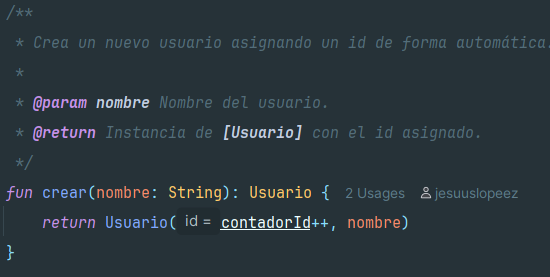

# Comentarios KDoc

- Para esta actividad tengo que al menos tengo que comentar 3 clases con KDoc en mi caso decidí comentar las clases:
  - Clase [Usuario](src/main/kotlin/dominio/Usuario.kt)
  - Clase[UsuarioService](src/main/kotlin/aplicacion/ActividadService.kt)
  - Clase [UsuarioRepository](src/main/kotlin/datos/UsuarioRepository.kt)

- Funciona de la siguiente manera:
  - Se genera el comentario escribiendo `/** ... */` justo antes de la clase a comentar o método.
  - En el comentario se describe la clase y el método y cualquier información relevante para su funcionamiento.
  - Existen diferentes etiquetas que alguna de ellas pueden ser las siguientes:
    - `@param`: Explica cada parámetro de una función o constructor. 
    - `@return`: Describe el valor que devuelve una función. 
    - `@throws / @exception`: Indica excepciones que puede lanzar. 
    - `@constructor`: Documenta el constructor principal de una clase. 
    - `@property`: Describe una propiedad de una clase.

## Clase Usuario

- Clase usuario

- Método crear

- Método configurarContador

- Método toString

## Clase UsuarioService

- Clase UsuarioService

- Método CrearUsuario

- Método eliminarUsuario

- Método obtenerUsuario

- Método buscarUsuarioPorId

## Clase UsuarioRepository

- Clase UsuarioRepository

- Método cargarUsuarios

- Método guardarUsuario

- Método agregar

- Método eliminar

- Método recuperarTodos

- Método recuperarPorId

# Instalación de Dokka

- Para comenzar la instalación de dokka tenemos que configurarlo en el proyecto en el build.gradle en el proyecto.
- Ahora tendremos que sincronizar el gradle.

# Generar documentación automática html Dokka

- La documentación será generada en el directorio [*build/doc*](build/doc)
- Para generar la documentación tendremos que seguir los siguientes pasos:
  - introducir ./gradlew dokkaHtml en la terminal
    
  - Tras esto se creará la documentación html en dentro del directorio build/doc.
  - Ahora podremos abrir el index.html generado y veremos toda nuestra documentación KDoc generada en html.
    
    
    

# Reponder preguntas

- **1 ¿Qué comentarios destacas y por qué?**

- Me gustaría destacar el comentario de la clase UsuarioService me parece que es un comentario perfecto para la clase, ya que explica perfectamente cuál es su función y con que partes del programa interactúa.

- Me gustaría destacar en este caso un método llamado crear en la clase Usuario me parece que el comentario cumple perfectamente su cometido de explicar que hace el método y gracias a las etiquetas sabemos qué parámetros recibe el método y que devuelve exactamente.

- **2 ¿Qué te aporta la documentación?**

- Obviamente, facilita el entendimiento del código lo cual puede provocar un mantenimiento del código más fácil incluso a la hora de crear nuevas funcionalidades al tener un mejor entendimiento del código el desarrollo será más rápido y se cometerán menos errores además si documentamos el código por ejemplo con KDoc nos permitirá generar documentación automática con herramientas como Dokka.