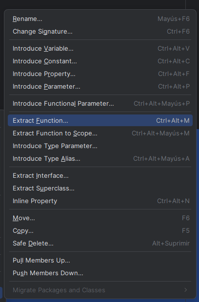
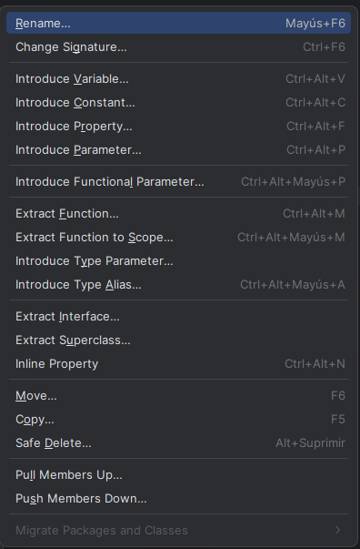
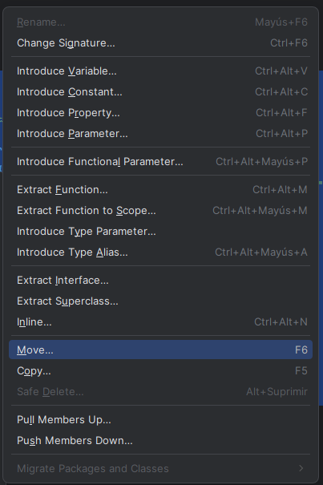

# Trabajo a realizar:

## 1. Comentarios KDoc:

- Revisar al menos 3 clases del proyecto Kotlin y añadir bloques KDoc sobre clases, métodos y atributos.

- Explicar en cada comentario el propósito y uso de la clase o método.

- `Usuario.kt`: https://github.com/RebelionAlberti/2425-varios-edes-prog-proyectotaskmanager-rebelion_alberti/blob/c31e51db1be4d63eb370ac88ae1c1ac8f743364b/src/main/kotlin/dominio/Usuario.kt#L1-L48
- `Actividad.kt`: https://github.com/RebelionAlberti/2425-varios-edes-prog-proyectotaskmanager-rebelion_alberti/blob/c31e51db1be4d63eb370ac88ae1c1ac8f743364b/src/main/kotlin/dominio/Actividad.kt#L1-L53
- `Evento.kt`: https://github.com/RebelionAlberti/2425-varios-edes-prog-proyectotaskmanager-rebelion_alberti/blob/c31e51db1be4d63eb370ac88ae1c1ac8f743364b/src/main/kotlin/dominio/Evento.kt#L1-L62

## 2. Generación con Dokka:

Configurar Dokka en el build.gradle.kts del proyecto.
https://github.com/RebelionAlberti/2425-varios-edes-prog-proyectotaskmanager-rebelion_alberti/blob/c31e51db1be4d63eb370ac88ae1c1ac8f743364b/build.gradle.kts#L1-L4
https://github.com/RebelionAlberti/2425-varios-edes-prog-proyectotaskmanager-rebelion_alberti/blob/c31e51db1be4d63eb370ac88ae1c1ac8f743364b/build.gradle.kts#L27-L29
Ejecutar la tarea de Dokka para generar la carpeta de documentación HTML u otro formato.

## 3. Capturas y proceso:

Tomar capturas del código con los bloques KDoc en el IDE (p.ej. IntelliJ IDEA).

Tomar capturas del navegador mostrando la documentación HTML u otro formato generada.

## 4. Documentación de proceso:
1. Añadir los comentarios a las clases y métodos elegidos con la sintaxis oficial de `KDoc`

2. Editar el archivo [build.gradle.kts](build.gradle.kts) para añadir el plugin de `Dokka`, en este caso, `id("org.jetbrains.dokka") version "1.9.10"`

3. Añadir esta línea para que la documentación de `Dokka` se guarde en el directorio `/doc`

       tasks.dokkaHtml {
       outputDirectory.set(file("doc"))
       }

4. Ejectuar `./gradlew dokkaHtml` para comenzar la creación de la documentación

5. Abrir los archivos `HTML` para ver toda la información

## Responder a las preguntas
1.  ¿Que comentarios destacas y por que?
   - Mayormente los que destaco son los comentarios de los métodos y clases, ya que dejan totalmente claro cual es su función y su finalidad. Además, otros comentarios que me resultan destacados son los de las propiedades y atributos, ya que si el nombre con el que están definidos no te da la información necesaria el comentario se encarga de dejarlo claro.

2. ¿Que te aporta la documentación?
   - Puede parecer que al principio hacerla no aporta nada, o simplemente un trabajo más tedioso sin ninguna finalidad, pero realmente lo que aportan los comentarios y la documentación es dejar claro el código y su funcionamiento, ya sea para mi mismo al verlo en un futuro o por si una persona nueva entra en el proyecto y tiene que trabajar sobre él, ya que hacerlo sobre un código bien documentado facilita mucho el trabajo.