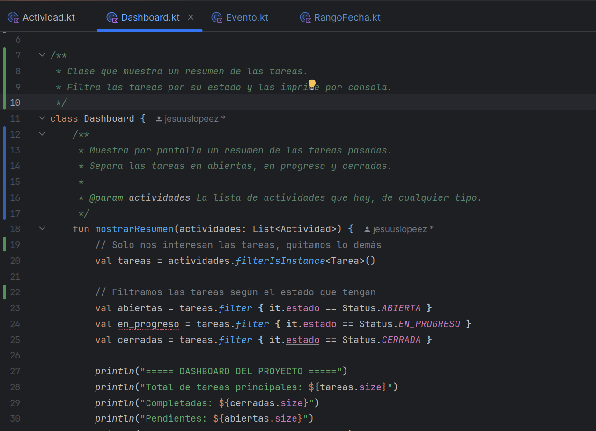
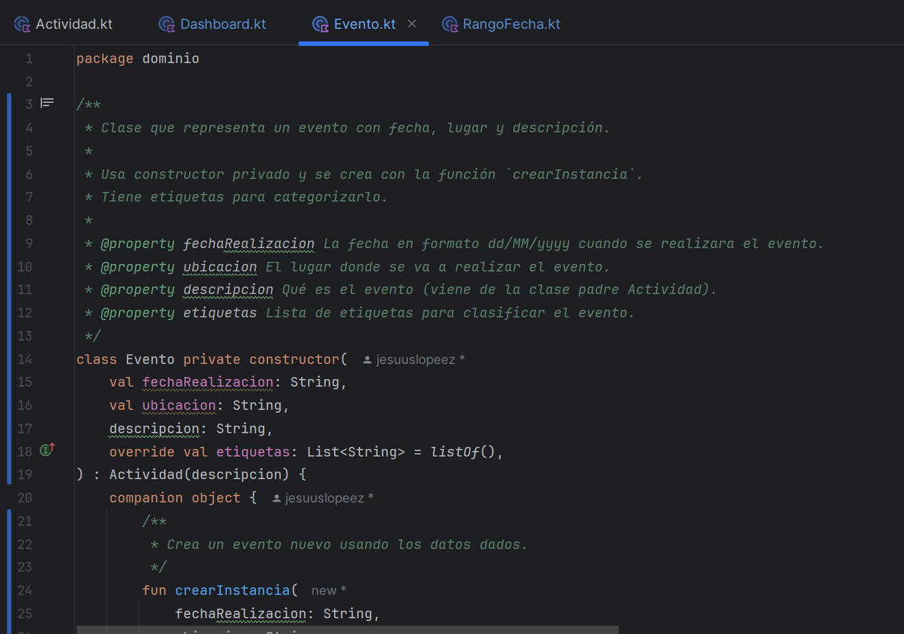
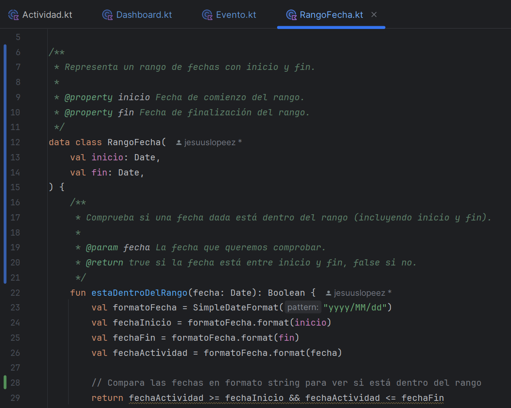
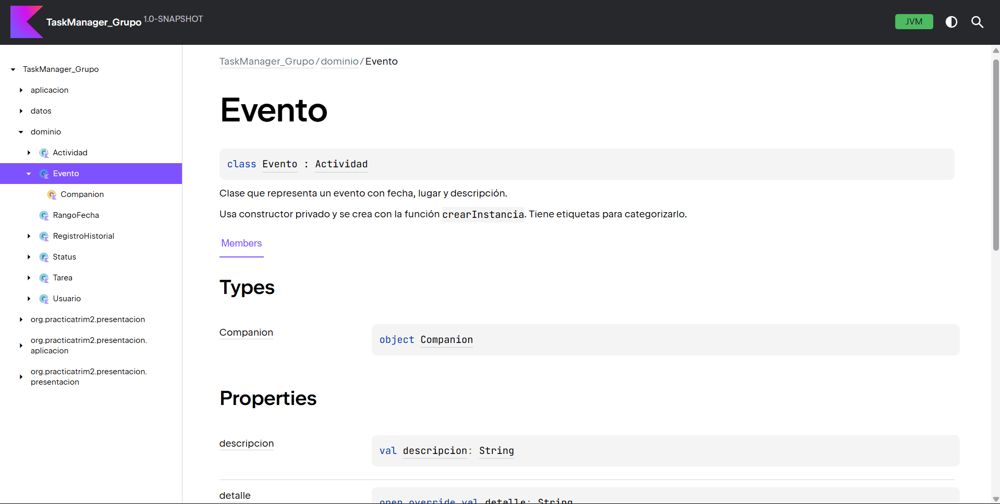
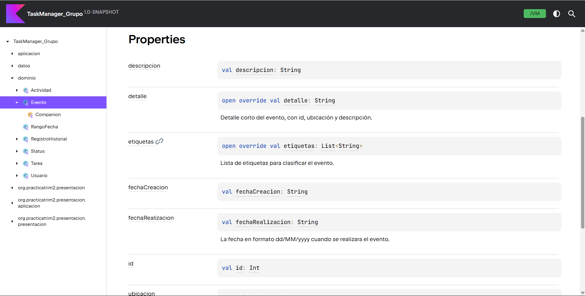
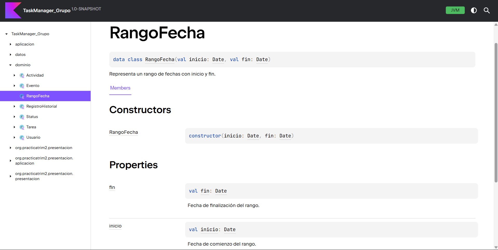
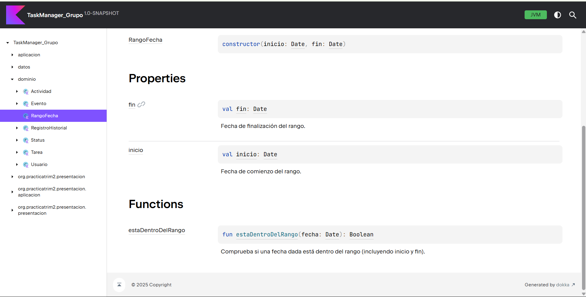
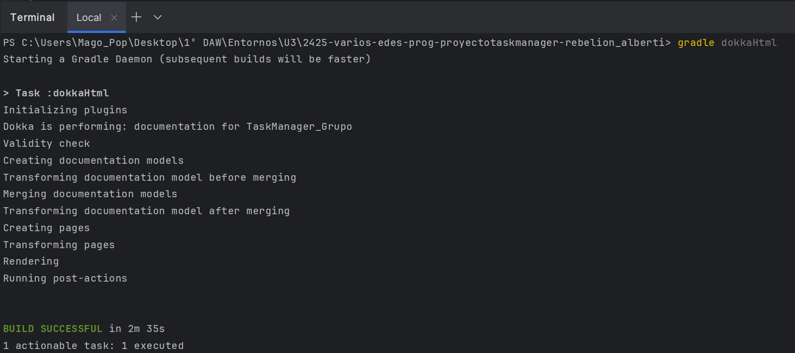

# Informe Práctica 4.4.1 - Documentación con KDoc y Dokka
---

## 1. Pasos realizados

- Añadí comentarios KDoc a tres clases del proyecto: `Dashboard`, `Evento` y `RangoFecha`.
- Configuré Dokka en `build.gradle.kts` añadiendo el plugin y la tarea para generar documentación HTML.
- Ejecuté el comando `gradle dokkaHtml` para generar la documentación.
- Verifiqué la documentación en el navegador abriendo `build/dokka/index.html`.

---

## 2. Capturas

### 2.1 Código con comentarios KDoc en IntelliJ IDEA

- Dashboard

- Evento

- RangoFecha

### 2.2 Documentación generada en navegador

- Evento

- RangoFecha

### 2.3 Terminal con comando Dokka sin errores

---

## 3. Respuestas a las preguntas

**1. ¿Qué comentarios destacas y por qué?**  
Destaco los comentarios de la clase `Evento` porque explican de forma sencilla para qué sirve, cómo se crea además de los atributos principales.

**2. ¿Qué te aporta la documentación?**  
La documentación facilita entender el proyecto rápidamente y ayuda a cualquiera que quiera saber qué hace cada clase sin tener que leer todo el código.

